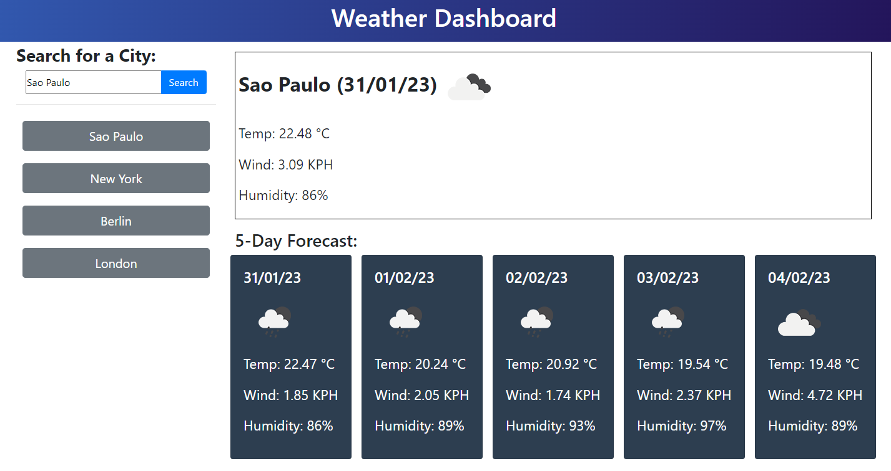

<!-- Improved compatibility of back to top link: See: https://github.com/othneildrew/Best-README-Template/pull/73 -->

<!--
*** Thanks for checking out the Best-README-Template. If you have a suggestion
*** that would make this better, please fork the repo and create a pull request
*** or simply open an issue with the tag "enhancement".
*** Don't forget to give the project a star!
*** Thanks again! Now go create something AMAZING! :D
-->
 

# Weather Dashboard

<!-- ABOUT THE PROJECT -->
## About The Project
 

This is a weather dashboard, built using Bootstrap and the Javascript Moment library. It uses the OpenWeather [Geocoding](https://openweathermap.org/api/geocoding-api), [current weather data](https://openweathermap.org/current) and [5 day weather forecast](https://openweathermap.org/forecast5) APIs to access and display weather data for any city the user searches for. It stores history for up to 6 cities in local storage. The aim of this project was to display my understanding of APIs and ability to work with and retrieve data from multiple at once. It was also useful practice with Bootstrap and element generation.

  

### Built With
[![Bootstrap][Bootstrap.com]][Bootstrap-url]

## Installation

N/A

<!-- USAGE EXAMPLES -->
## Usage

Follow this link to the deployed page:

https://guilhfreitas.github.io/guilh-weatherdashboard/

Click in the search box and type in the city you want to see the forecast for, then click the Search button. The app will fetch the data for the current weather and the forecast for the next 5 days, display it on the page, and store your search in the history. Clicking on one of your previous searches from the list will then quickly perform the same search again.

<!-- ACKNOWLEDGMENTS -->
## Acknowledgments

* [Best README Template](https://github.com/othneildrew/Best-README-Template/pull/73)

<!-- MARKDOWN LINKS & IMAGES -->
[Bootstrap.com]: https://img.shields.io/badge/Bootstrap-563D7C?style=for-the-badge&logo=bootstrap&logoColor=white
[Bootstrap-url]: https://getbootstrap.com
